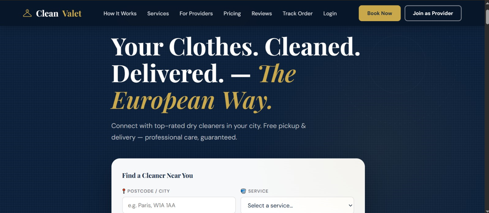

# CleanValet Marketplace Platform

A modern SaaS-style marketplace platform that connects customers with premium dry-cleaning service providers through a centralized booking, provider management, and administrative ecosystem.

---

## Project Overview

CleanValet is a multi-vendor marketplace designed to digitize the dry-cleaning industry. Customers can discover cleaning services, place orders, and track service progress, while providers manage operations through a structured platform and administrators monitor the entire ecosystem from a centralized dashboard.

The project demonstrates marketplace architecture, SaaS product design principles, responsive web interfaces, and administrative workflow management.

---

## Key Features

### Customer Marketplace

- Service discovery
- Service booking workflow
- Order tracking
- Customer reviews
- Responsive user interface
- Mobile-friendly experience

### Provider Management

- Provider onboarding
- Provider approval workflow
- Service management
- Revenue tracking
- Commission management
- Performance monitoring

### Administrative Dashboard

- Dashboard overview
- Provider management
- Customer management
- Order monitoring
- Revenue & payouts
- Platform settings
- Business analytics

### Architecture Documentation

- Marketplace workflow
- Platform architecture
- Business model explanation
- Provider ecosystem structure

---

## Screenshots

### Homepage



### Admin Control Panel


### Provider Management


---

## Platform Workflow

Customer
↓
Browse Services
↓
Place Order
↓
CleanValet Platform
↓
Service Provider
↓
Order Processing
↓
Order Completion
↓
Customer Feedback

---

## Technology Stack

### Frontend

- HTML5
- CSS3
- JavaScript (ES6)

### UI/UX

- Responsive Design
- Modern Dashboard Interface
- Mobile-Friendly Layout
- Marketplace-Oriented User Experience

### Architecture

- Multi-Vendor Marketplace
- SaaS Product Model
- Administrative Control System

---

## Project Structure

```text
cleanvalet/

├── index.html
├── admin.html
├── structure.html
│
├── image/
│   ├── home.png
│   ├── admin-dashboard.png
│   └── provider-management.png
│
└── README.md
```
## Business Model

Customer → CleanValet Platform → Service Provider

Revenue opportunities include:

- Provider commission fees
- Premium provider subscriptions
- Featured service listings
- Marketplace service charges

---

## Future Roadmap

- User Authentication
- Provider Login System
- Customer Accounts
- Payment Gateway Integration
- Firebase Backend
- Database Integration
- Mobile Application
- Real-Time Notifications
- AI-Based Recommendations

---

## Learning Outcomes

This project demonstrates practical experience in:

- Frontend Development
- SaaS Product Design
- Marketplace Architecture
- Dashboard Development
- Responsive Web Design
- Business Workflow Modeling

---

## Author

**Umair Ali**

Computer Engineering Student

Sir Syed University of Engineering and Technology (SSUET)

Karachi, Pakistan

---

## License

This project is intended for educational, portfolio, and learning purposes.